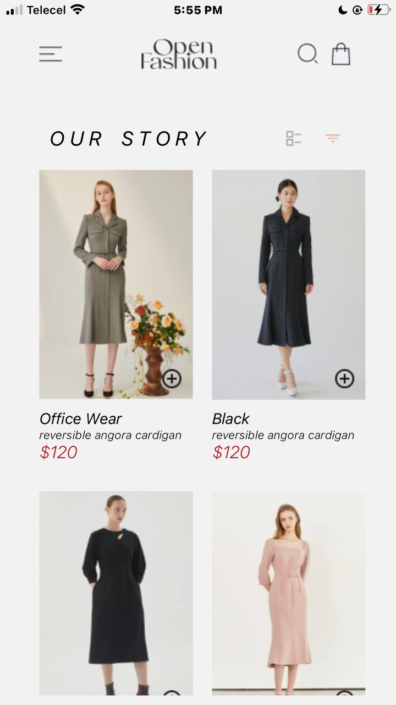
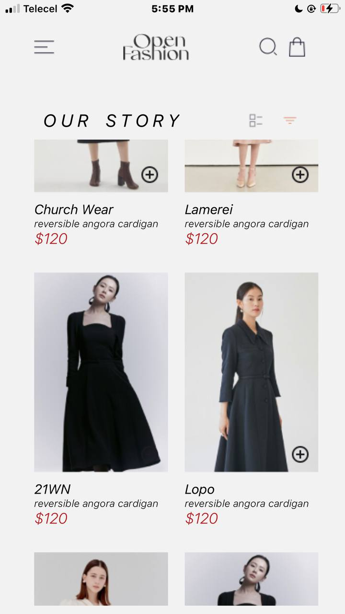
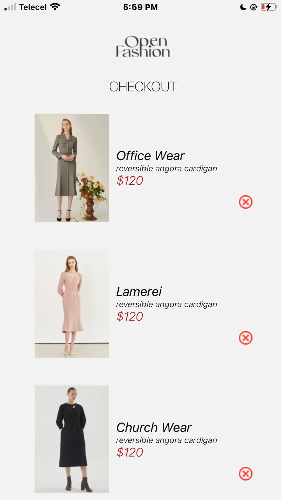
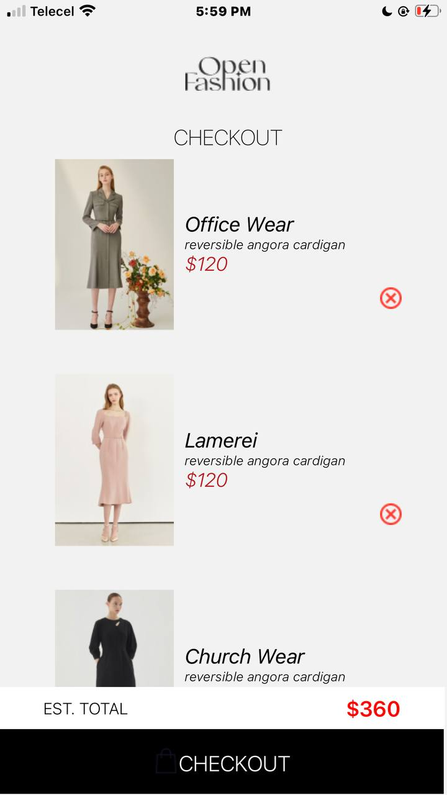

# React Native Shopping Cart Application
ID- 11065950 , OJI NANA AKPAABE-ADESSA

# Table of Contents
Project Description
Design Choices
Components
Functionality
Local Storage
Installation
Usage
Screenshots

## Project Description
This assignment involves recreating a shopping cart mobile application based on the provided UI mockup. The application consists of a Home Screen displaying a list of available products and a Cart Screen displaying selected items. Users can add products to their cart, remove products from their cart, and view the items in their cart. The selected items are stored locally on the device using AsyncStorage.

## Design 
User Interface: The UI design was followed as per the mockup provided. Components were styled to closely match the design.
Local Storage: AsyncStorage was used to store selected items locally on the device. This choice was made due to its ease of use and integration with React Native.

## Components
1. HomeScreen
Displays a list of available products.
Each product has an "Add to Cart" button.
Contains a shopping bag button to navigate to the Cart Screen.
2. CartScreen
Displays selected items in the cart.
Each item has a "Remove from Cart" button.
Shows the total estimated cost.
Contains a "Checkout" button.
3. ProductItem
Represents an individual product in the HomeScreen.
Includes product image, brand, name, price, and "Add to Cart" button.
4. CartItem
Represents an individual item in the CartScreen.
Includes product image, brand, name, price, and "Remove from Cart" button.

## Functionality
Users Should Be Able To:
View a list of available products.
Add products to their cart.
Remove products from their cart.
View the items in their cart.
Local Storage

Implementation of AsyncStorage:
Storing Items: When a product is added to the cart, it is saved in AsyncStorage.
Fetching Items: When the CartScreen is loaded, items are fetched from AsyncStorage.
Updating Items: When a product is removed from the cart, the updated cart is saved back to AsyncStorage.

## SCREENSHOTS

